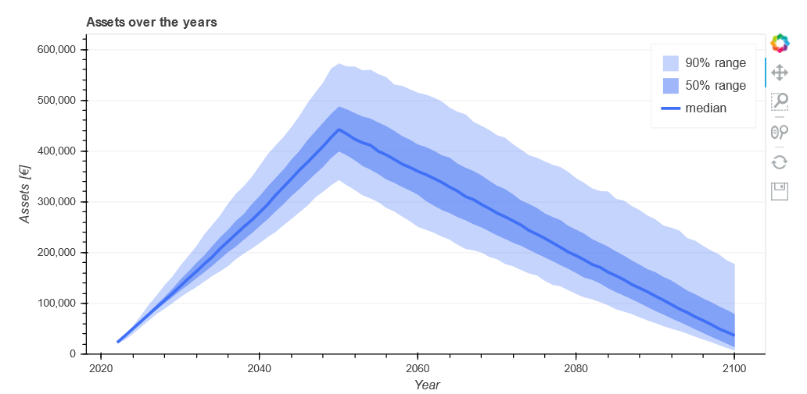
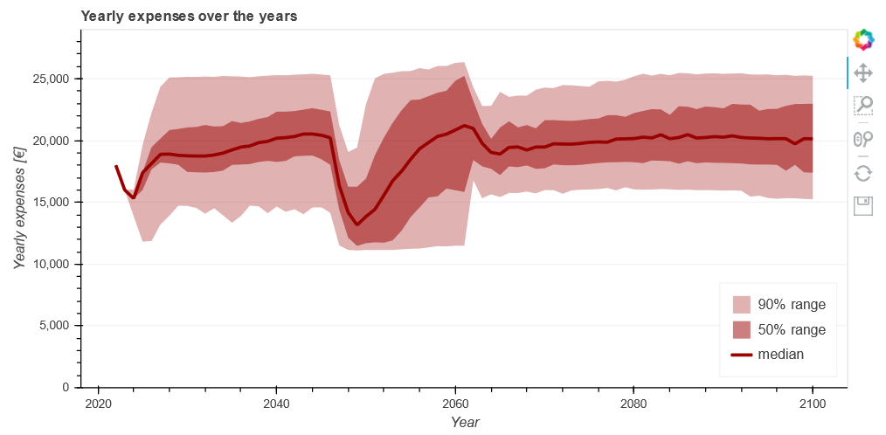
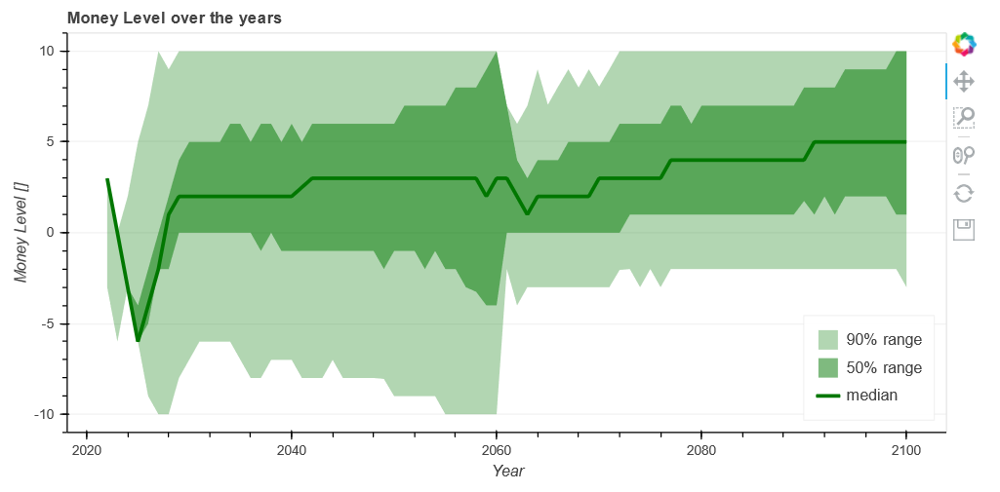

Future Planner
=====

Plan your future today!

Ever wondered how your future will look like? 
This tool can help you, at least concerning your finances.

An example how your future could look like:

Install
----------

pip install -e .

Use
----------------
- Create a config.yaml that suites you
- Run the analysis with *utils.run_toys(config=config, runs=1000)*
- Plot attribute distributions you are intrest in with *plot_utils.create_plot*

Example code can be found in *run_analysis.ipynb*.

